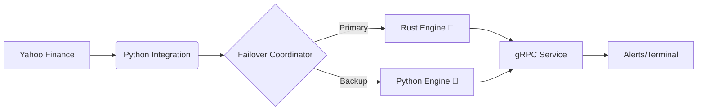

# 🚀 ChanLun (缠论) Intelligent Trading System
**Master the Market with Precision. Powered by Rust + Python Hybrid Core.**

<div align="center">

[](https://opensource.org/licenses/MIT)
[](https://www.rust-lang.org/)
[](https://www.python.org/)
[](https://www.docker.com/)

**The ultimate tool for Pen Theory (笔理论) practitioners. Automated. Real-time. Fail-safe.**

[Quick Start](#-get-started-in-2-minutes) • [Sales Points](#-core-sales-points) • [Architecture](#-high-performance-architecture) • [Usage](#-how-to-use)

</div>

---

## 💎 Why choose this system?

Most trading bots are either too slow to capture entry points or too rigid to implement complex theories like **ChanLun (缠论)**. 

Our system bridges this gap:
*   **Crushing Performance**: Rust-core handling heavy computations with microsecond latency.
*   **Zero-Cost Data**: Built-in **Yahoo Finance** integration. No expensive API keys required.
*   **Total Market Coverage**: US Stocks, ETFs (UVIX/SPY), Crypto (BTC), and Global Indices.
*   **Battle-Tested Theory**: Strict implementation of New Pen (新笔), Line Segments, and Center Detection.

---

## 🔥 Core Sales Points

### 📡 1. Real-time Multi-Timeframe Monitoring
Whether you are a scalper or a long-term investor, we've got you covered.
*   **🚀 5m Scalper**: Capture the smallest fractal reversals for intra-day trades.
*   **🎯 30m Swing**: Perfect for Identifying Type 1/2/3 buy points for multi-day moves.
*   **📈 Daily Investor**: Monitor long-term "Center" (中枢) breakouts for portfolio growth.

### 🔔 2. Intelligent Buy/Sell Alerts
Don't stare at charts all day. The system detects **Divergence (背驰)** and triggers alerts once price criteria are met.
```bash
# Monitor UVIX for a Type 1 Buy Point on 30m candles
python launcher.py monitor UVIX --level 30m --alert telegram
```

### 🦀 3. Hybrid Reliability
If the high-speed Rust engine fails, the Python backup takes over **instantly**. Your monitoring never stops.

---

## 🚀 Get Started in 2 Minutes

### The Docker Way (Easiest)
Spin up the entire stack including the primary engine, backup, and health monitor:
```bash
docker-compose --profile backup --profile monitor up -d
docker-compose logs -f
```

### The Developer Way
```bash
# 1. Setup Environment
python3 -m venv venv && source venv/bin/activate
pip install -r python-layer/requirements.txt && pip install -e python-layer

# 2. Build & Analyze
./scripts/build.sh
python launcher.py analyze AAPL --level 30m
```

---

## 🛠️ Usage Scenarios

| Your Goal               | Suggested Command                              |
| :---------------------- | :--------------------------------------------- |
| **Quick Analysis**      | `python launcher.py analyze MSFT`              |
| **Day Trading (5m)**    | `python launcher.py monitor UVIX --level 5m`   |
| **Swing Trading (30m)** | `python launcher.py monitor TSLA --level 30m`  |
| **Long-term (Daily)**   | `python launcher.py monitor ^GSPC --level day` |
| **Learn the Logic**     | `python launcher.py examples --list`           |

---

## 🏗️ High-Performance Architecture



*   **Primary Engine**: Written in Rust for strict mathematical precision.
*   **Backup Engine**: Written in Python for flexibility and rapid strategy iteration.
*   **Failover**: Heartbeat-based monitoring ensures 99.9% uptime.

---

## ⚙️ Effortless Configuration
Fine-tune your strategy in `config/default.yaml`:
```yaml
pen:
  definition: new_3kline     # Strict "New Pen" logic
  strict_validation: true    # Filter out weak signals
macd:
  fast_period: 12            # Default 12/26/9 or your custom edge
```

---

## 🤝 Community & Support
*   **MIT Licensed**: Free to use, modify, and distribute.
*   **Built for Traders**: Created by traders who understand that every second counts.

<div align="center">
**Ready to trade smarter?**<br>
[Star this Repo](https://github.com/weisenchen/chanlunInvester) ⭐ to stay updated!
</div>
